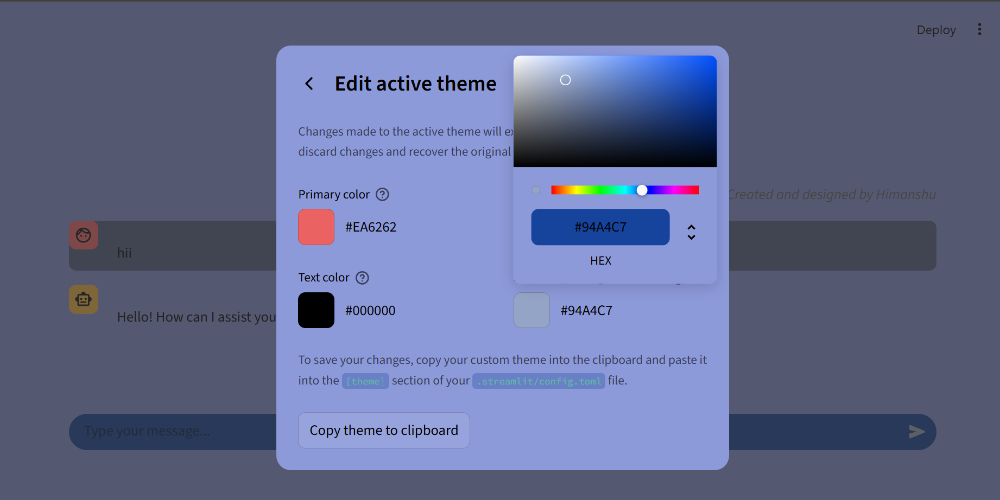

# DeepSeek R1 Chatbot

A sleek Streamlit chatbot interface powered by the DeepSeek R1 model, integrated via OpenRouter and LangChain. Designed for simple, elegant interactions with AI.

  

---

## Features

Real-time AI conversation using LangChain + DeepSeek R1
-  Memory-based chat history
   Beautiful custom UI with light/dark mode support
   API-secure via Streamlit Secrets

